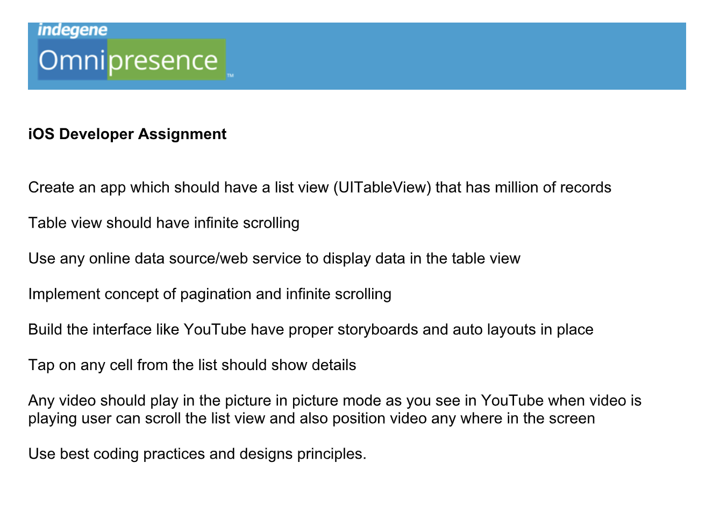
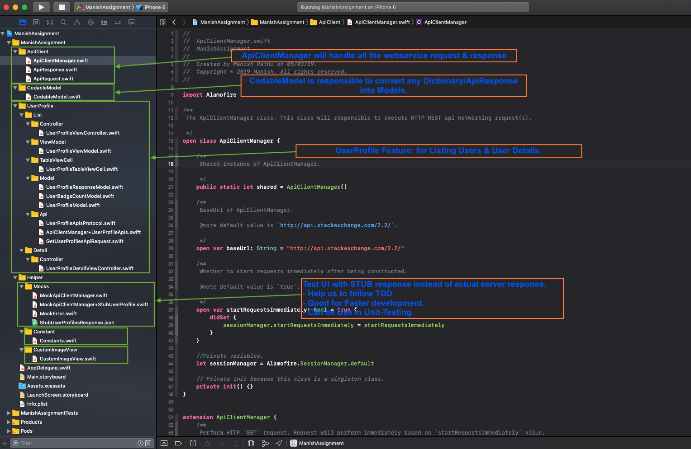

# IndegeneAssignment
Indegene Company Assignment - iOS Role 06-March-2019


-------------------

This is Assignment project given by Indegene company, I follow the following steps to finish the assignment.
# Step by Step Solution
After follow the below steps, solution looks like below:


-------------------

### Step1: Create new iOS application.
Created new single page iOS application, named as `ManishAssignment`.

### Step2: Install the external dependency/library
This project need web-service integration, also require download images from server. So I added below two cocoa pods-dependency:
- **Alamofire** for web-service integration.
- **Kingfisher** for image download & image-cache. Now a days one of the best library written in pure Swift.

#### CocoaPods Installation for Above
[CocoaPods](http://cocoapods.org) is a dependency manager for CocoaProjects.
```ruby
source 'https://github.com/CocoaPods/Specs.git'

# ignore all warnings from all pods
inhibit_all_warnings!

platform :ios, '10.0'
target 'ManishAssignment' do
    use_frameworks!

    pod 'Alamofire'
    pod 'Kingfisher'

    target 'ManishAssignmentTests' do
        #Pods for Testing.
    end
end
```

### Step3: Folder Structure
Folder structure looks like below, we will cover them one by one in details:


### Step4: Build ApiClientManager
Build the `ApiClientManager` top of Alamofire framework, This is helpful for unit-testing in case of Mocking, also if we need to replace `Alamofire` with different library can be easily done.
Currently ApiClientManager can perform:
- `GET` web-service
- `POST` web-service
- `PUT` web-service
- `DELETE` web-service

**Note**: Every request of ApiClientManager take `APIRequest` Type object as input and return `APIResponse` Type object in response.

### Step5: Convert Api response into Model(s)
Introduced `CodableModel` protocol, which has helpful function to convert any dictionary/APIResponse into Model(s).
```swift
/**
 The `CodableModel` protocol. All model(s) should inherit from this protocol.

 */
public protocol CodableModel: Codable {}


/**
 The `CodableModel` Extension.
 Input: A `Dictionary` or `ApiResponse` which Return a JSON Object.
 Output: A `BaseModel` instance.

 */
extension CodableModel {

    /**
     Init model by using `Dictionary` as Input.

     @return BaseModel instance or nil.

     */
    public static func initWithDictionary<T: CodableModel>(_ dictionary: [String: Any]) -> T? {
        do {
            let data = try JSONSerialization.data(withJSONObject: dictionary, options: [])
            return initWithData(data)
        } catch {
            return nil
        }
    }

    /**
     Init model by using `ApiResponse` as Input.

     @return CodableModel instance or nil.

     */
    public static func initWithResponse<T: CodableModel>(_ response: ApiResponse) -> T? {
        guard let data = response.data else {
            print("Response data is nil.")
            return nil
        }
        return initWithData(data)
    }


    /**
     Init model by using `Data` as Input.

     @return CodableModel instance or nil.

     */
    public static func initWithData<T: CodableModel>(_ data: Data) -> T? {
        do {
            return try JSONDecoder().decode(T.self, from: data)
        } catch let error {
            print("Error in JSONDecoder().decode:", error)
            return nil
        }
    }
}
```

### Step6: Find public Api(s) which we can use in demo project


# ---------------------- Updating ReadMe file (In PROGRESS) -----------------------------

# Requirements
- iOS 10.0+
- Xcode 10.1
- macOS 10.14

# Swift version
* Swift 4.2

# LICENSE
* MIT
