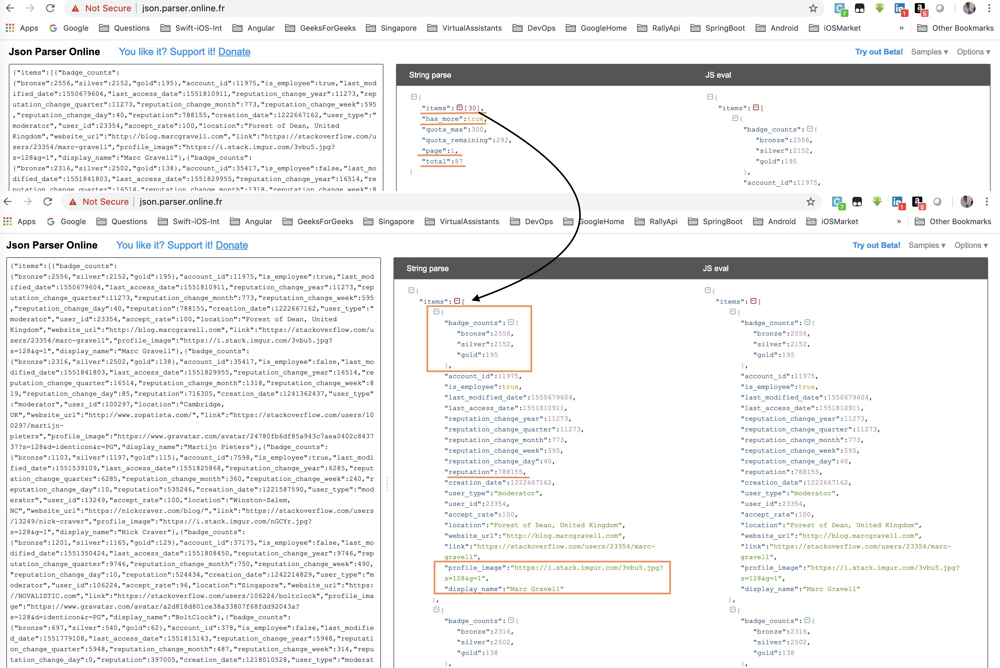

# IndegeneAssignment
Indegene Company Assignment - iOS Role 06-March-2019


-------------------

This is Assignment project given by Indegene company, I follow the following steps to finish the assignment.
# Step by Step Solution
After follow the below steps, solution looks like below: <br/>
:point_right: Create an app which should have a list view (UITableView) that has million of records. ✅ <br/>
:point_right: Table View should have infinite scrolling. ✅ <br/>
:point_right: Use any online data source/web service to display data in the table view. ✅ <br/>
:point_right: Implement concept of pagination and infinite scrolling. ✅ <br/>
:point_right: Build the interface like YouTube have proper storyboards and auto layouts in place. ✅ <br/>
:point_right: Tap any cell from the list should show details. ✅ <br/>
:point_right: Use best coding practices and design principles. ✅ <br/>
 - **TODO:** 😞 <br/>
:point_right: Any video should play in the picture mode as you see in Youtube when video is playing user can scroll the list view and position video any where in screen. <br/>


-------------------

### Step1: Create new iOS application.
Created new single page iOS application, named as `ManishAssignment`.

### Step2: Install the external dependency/library
This project need web-service integration, also require download images from server. So I added below two cocoa pods-dependency:
- **Alamofire** for web-service integration.
- **Kingfisher** for image download & image-cache. Now a days one of the best library written in pure Swift.

#### CocoaPods Installation for Above
[CocoaPods](http://cocoapods.org) is a dependency manager for CocoaProjects.
```ruby
source 'https://github.com/CocoaPods/Specs.git'

# ignore all warnings from all pods
inhibit_all_warnings!

platform :ios, '10.0'
target 'ManishAssignment' do
    use_frameworks!

    pod 'Alamofire'
    pod 'Kingfisher'

    target 'ManishAssignmentTests' do
        #Pods for Testing.
    end
end
```

### Step3: Folder Structure
Folder structure looks like below, we will cover them one by one in details:


### Step4: Build ApiClientManager
Build the `ApiClientManager` top of Alamofire framework, This is helpful for unit-testing in case of Mocking, also if we need to replace `Alamofire` with different library can be easily done.
Currently ApiClientManager can perform:
- `GET` web-service
- `POST` web-service
- `PUT` web-service
- `DELETE` web-service

**Note**: Every request of ApiClientManager take `APIRequest` Type object as input and return `APIResponse` Type object in response.

### Step5: Convert Api response into Model(s)
Introduced `CodableModel` protocol, which has helpful function to convert any dictionary/APIResponse into Model(s).
```swift
/**
 The `CodableModel` protocol. All model(s) should inherit from this protocol.

 */
public protocol CodableModel: Codable {}


/**
 The `CodableModel` Extension.
 Input: A `Dictionary` or `ApiResponse` which Return a JSON Object.
 Output: A `BaseModel` instance.

 */
extension CodableModel {

    /**
     Init model by using `Dictionary` as Input.

     @return BaseModel instance or nil.

     */
    public static func initWithDictionary<T: CodableModel>(_ dictionary: [String: Any]) -> T? {
        do {
            let data = try JSONSerialization.data(withJSONObject: dictionary, options: [])
            return initWithData(data)
        } catch {
            return nil
        }
    }

    /**
     Init model by using `ApiResponse` as Input.

     @return CodableModel instance or nil.

     */
    public static func initWithResponse<T: CodableModel>(_ response: ApiResponse) -> T? {
        guard let data = response.data else {
            print("Response data is nil.")
            return nil
        }
        return initWithData(data)
    }


    /**
     Init model by using `Data` as Input.

     @return CodableModel instance or nil.

     */
    public static func initWithData<T: CodableModel>(_ data: Data) -> T? {
        do {
            return try JSONDecoder().decode(T.self, from: data)
        } catch let error {
            print("Error in JSONDecoder().decode:", error)
            return nil
        }
    }
}
```

### Step6: Find public Api(s) which we can use in demo project
- The Stack Exchange API provides a mechanism to query items from the `Stack Exchange` network.
- We are going to use the `/users/moderators API`. As the name implies, it returns the list of users for a specific site.
- The `API response is paginated`; the first time we request the list of users, we won’t receive the whole list. Instead, we’ll get a list with a limited number of the users (a page) and a number indicating the total number of users in their system.
- To learn more about this specific API, visit [Usage of /users/moderators](https://api.stackexchange.com/docs/moderators).

Here’s the JSON response:


### Step6: Setup GetUserProfiles API
- This section can be divided into 3 simple steps.

#### Step6.1: Define protocol for UserProfile API
This is critical step, by using protocol we will able to use Mock/FAKE response later point of time.
```swift
/**
 UserProfile Apis Protocol

 @note: Prorocol oriented approach will always help us in STUB/FAKE response.
 */
protocol UserProfileApisProtocol {
    /**
     User Profile Api(s).
     */
    func fetchUserProfiles(page: Int, completionBlock: @escaping (UserProfileResponseModel?, Error?) -> Void)


    /**
     TODO: Write here more User Profile related Api(s).

     */
}
```

#### Step6.2: Prepare GetUserProfiles API request
In this step, we are going to prepare `GetUserProfilesApiRequest` which will Implement `ApiRequest` 👆.  
```swift
/**
 UserProfile Apis Protocol

 @note: Prorocol oriented approach will always help us in STUB/FAKE response.
 */
protocol UserProfileApisProtocol {
    /**
     User Profile Api(s).
     */
    func fetchUserProfiles(page: Int, completionBlock: @escaping (UserProfileResponseModel?, Error?) -> Void)


    /**
     TODO: Write here more User Profile related Api(s).

     */
}
```

#### Step6.3: Lets Implement fetchUserProfiles API defined in Step6.1
This step will use `GetUserProfilesApiRequest` from Step6.2 and process the request using `ApiClientManager`. On completion, This will return the `UserProfileResponseModel` object or Error (in case of any).
Api has `page` as input parameter, which will be helpful for pagination API implementation.
```swift
/**
 User Profile Api(s).
 These Api request(s) will be Async request, completionBlock will called when request will finish.

 */
extension ApiClientManager: UserProfileApisProtocol {

    /**
     Fetch User Profile Api: Fetch User Profile from Server.

     */
    func fetchUserProfiles(page: Int, completionBlock: @escaping (UserProfileResponseModel?, Error?) -> Void) {
        // Create Instance of `Get UserProfiles Api Request`
        var userProfileRequest = GetUserProfilesApiRequest()
        userProfileRequest.path = String(format: userProfileRequest.path, page)

        // Call "GET" UserProfile Api.
        self.get(userProfileRequest) { (response) in
            if response.isValid {
                completionBlock(UserProfileResponseModel.initWithResponse(response), response.error)
            } else {
                completionBlock(nil, response.error)
            }
        }
    }


    /**
     TODO: Write here more User Profile related Api(s).

     */
}
```

### Step7: Define Model(s)
- Our `fetchUserProfiles` api is ready. Let's define the Model(s), All model will inherit from `CodableModel` 👆, so Parsing logic will become so simple.
- Based on JsonResponse, we require `3 CodableModel` models.
- Let's see:  
- **1. Top Level Model** -> `UserProfileResponseModel`
```swift
/**
 User Profile Response Model.
 */
struct UserProfileResponseModel: CodableModel {
    let userProfiles: [UserProfileModel]
    let total: Int
    let hasMore: Bool
    let page: Int
    let quotaMax: Int
    let quotaRemaining: Int

    enum CodingKeys: String, CodingKey {
        case userProfiles = "items"
        case hasMore = "has_more"
        case quotaMax = "quota_max"
        case quotaRemaining = "quota_remaining"
        case total
        case page
    }
}
```
- **2. UserProfile Model** -> `UserProfileModel`
```swift
/**
 User Profile Model.
 */
struct UserProfileModel: CodableModel {
    let accountId: Int
    let reputation: Int
    let userType: String
    let userId: Int
    let name: String
    let badgeCounts: UserBadgeCountModel
    let image: String?
    let location: String?
    let websiteUrl: String?

    enum CodingKeys: String, CodingKey {
        case accountId = "account_id"
        case userType = "user_type"
        case userId = "user_id"
        case name = "display_name"
        case image = "profile_image"
        case websiteUrl = "website_url"
        case badgeCounts = "badge_counts"
        case reputation
        case location
    }
}
```
- **3. UserBadgeCount Model** -> `UserBadgeCountModel`
```swift
/**
 User Badge Count Model.
 */
struct UserBadgeCountModel: CodableModel {
    let bronze: Int
    let silver: Int
    let gold: Int
}
```


# ---------------------- Updating ReadMe file (In PROGRESS) -----------------------------

# Time spent
- 7 hours approx. after office working hours. 🚀

# Requirements
- iOS 10.0+
- Xcode 10.1
- macOS 10.14

# Swift version
* Swift 4.2

# LICENSE
* MIT
